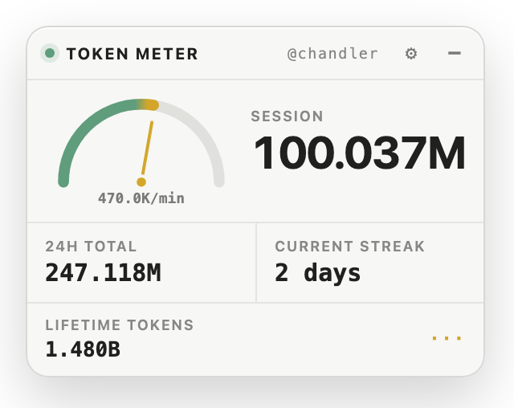
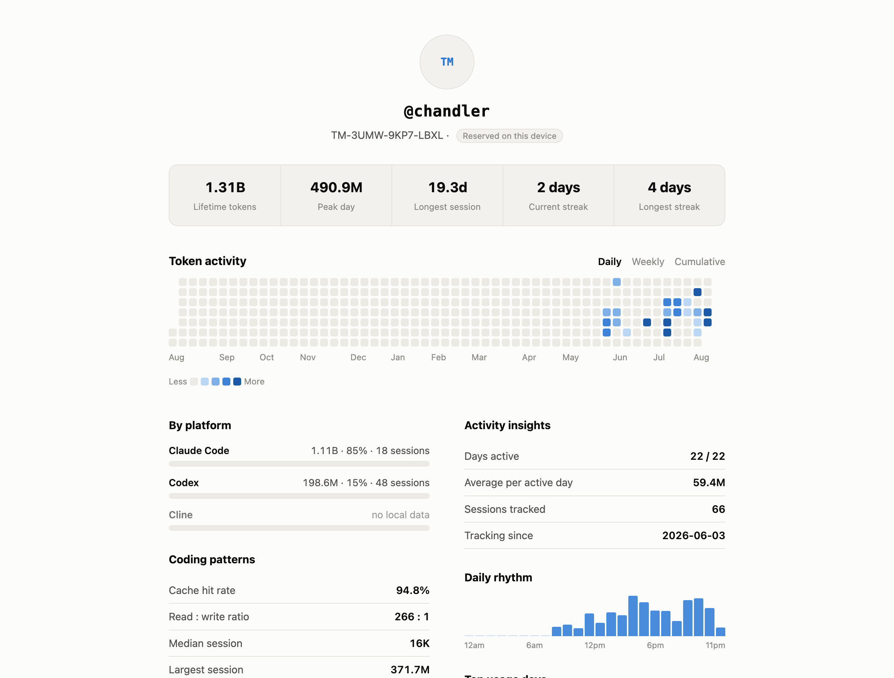
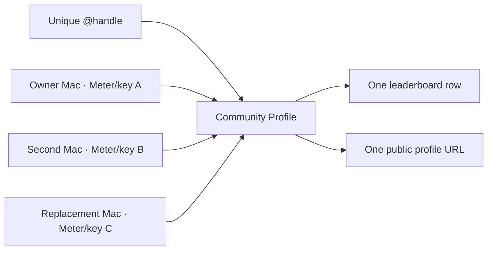
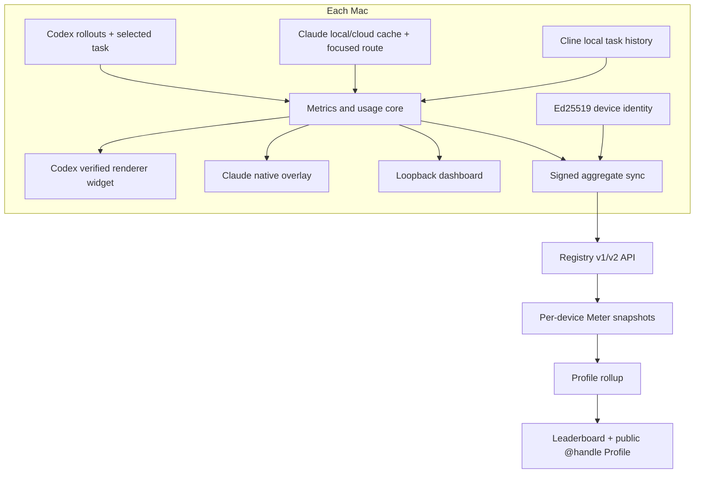

# Token Widget

<p align="center">
  
</p>

<p align="center">
  <strong>See how hard your Agent is working.</strong><br>
  Live, local-first token telemetry for Codex and Claude Code, with a private dashboard and optional community Profile.
</p>

<p align="center">
  <a href="https://github.com/SergioChan/token-meter/actions/workflows/ci.yml"></a>
  <a href="LICENSE"></a>
  
  
</p>

<p align="center">
  
</p>

Token Widget is an unofficial, open-source macOS companion for coding Agents. It follows the exact Session selected in the host app and turns confirmed local token events into a compact instrument panel: cumulative workload, active Context, current-turn usage, rate, history, compactions, child Agents, and anomaly alerts.

It is built for the failure mode that percentages hide: a polluted Context, retry loop, or background-Agent spiral that makes one interaction consume several times its normal workload.

## Download

The signed and Apple-notarized DMG is the primary release channel:

- [Download Token Widget for macOS](https://www.tokenwidget.app/download/token-widget.dmg)
- [Latest GitHub release](https://github.com/SergioChan/token-meter/releases/latest)

Open the DMG, drag **Token Widget.app** to **Applications**, and open it once. The app contains its own compatible Node.js runtime. The Claude Desktop overlay requires macOS Accessibility permission for **Token Widget**; it never asks for permission on behalf of Claude.

The Codex Desktop adapter currently uses its per-user source installer described below. The repository also remains the development and recovery installation path for both hosts.

> **Multi-device release gate:** this source tree contains the next-release Profile/device model and v2 aggregate sync protocol. Do not enable multi-device Profile reads in production until the additive database migration, reconciliation, and verification gates in [the migration runbook](docs/multi-device-migration.md) have all passed. Older v1 clients remain compatible during the rollout.

## What Token Widget supports

| Source or host | Live overlay | Historical dashboard and Profile | Exact binding |
| --- | --- | --- | --- |
| Codex Desktop on macOS | Supported | Supported | Active semantic task UUID + local rollout events |
| Claude Code in Claude Desktop on macOS | Beta | Supported | Focused Code route + exact local/cloud Session records |
| Cline in Code, Cursor, or VSCodium | Not currently | Supported | Local Cline task history |
| Windows and Linux | Not implemented | Not implemented | — |

The Claude integration is an independent native overlay. Production Claude Desktop does not expose public CDP without Anthropic authorization, and Token Widget does not bypass that control. It never injects into, patches, re-signs, quits, or relaunches Claude.app.

The Codex integration uses a verified loopback CDP adapter. It validates the official application signature, listener ownership, and renderer semantics before attaching, and never modifies or re-signs the official app bundle.

Read the host-specific invariants:

- [Codex Desktop integration](integrations/codex-desktop/README.md)
- [Claude Code in Claude Desktop integration](integrations/claude-desktop/README.md)

## Live instruments

| Instrument | Meaning |
| --- | --- |
| **Session** | Raw cumulative tokens confirmed for the selected root Session and its known child Agents. |
| **1H Session** | Positive token deltas for that Session tree during the trailing hour. |
| **Current Turn** | Cumulative deltas since the latest root user message. |
| **Active Context** | Tokens occupying the selected root Context, shown against its model window when available. |
| **Rate** | Confirmed deltas in a trailing 60-second window, normalized to tokens per minute. |
| **Baseline** | Completed-turn median, p95, and median absolute deviation used for anomaly detection. |
| **Compactions** | Confirmed Context compaction events for the selected Session. |
| **Session skills** | Compact loaded/not-loaded skill icons; hover reveals the skill name and status. |

The gauge moves from green through yellow and orange to red as live rate rises relative to the learned scale. Red communicates intensity; it is not a claim that the host is broken. The separate runaway alert uses a deliberately conservative historical classifier.

Click `−` to collapse the widget to its gauge and live rate, or `+` to expand it. Drag the expanded header or collapsed gauge. Layout and collapsed state persist across Session changes and service restarts.

## Exact Session binding

Token Widget never guesses the selected Session from process recency, transcript modification time, or whichever file changed last.

- **Codex:** reads the active semantic sidebar task UUID and groups descendants that share its root `session_id`.
- **Claude:** reads an exact `local_<uuid>` or mixed-case `session_<24 chars>` from the focused Claude Code web area, then resolves only the matching local transcript or complete cached cloud-event sequence.

If identity is missing, ambiguous, or unsupported, the widget becomes unbound or hides. It does not carry numbers from the previous Session into the next one.

### Codex workload

The collector incrementally reads numerical events from `~/.codex/sessions/**/rollout-*.jsonl`. Session workload is the sum of each Session-tree member's latest cumulative token count. Rolling windows use positive changes between consecutive cumulative snapshots:

```text
delta = current >= previous ? current - previous : current
```

Cached input is already included in Codex's reported total and is counted once. Active Context is separate: it uses the root task's latest `last_token_usage.total_tokens` and `model_context_window`, so it may fall after compaction while cumulative Session workload never decreases.

Local raw workload is not a billing meter and does not claim to reproduce Codex `/usage`. The backend account surface does not expose safe per-Session attribution. See [the reconciliation research](docs/research/codex-account-usage-reconciliation.md).

### Claude workload

Legacy local Sessions resolve their exact Desktop `local_<uuid>` to one Claude Code transcript. Current cloud Code Sessions bind the exact `session_<24 chars>` route and accept only complete, contiguous locally cached `/events` sequences. Repeated responses are de-duplicated by response identity.

```text
raw tokens = input_tokens
           + cache_creation_input_tokens
           + cache_read_input_tokens
           + output_tokens
```

Claude Active Context uses only the latest root response's input side:

```text
active context = input_tokens
               + cache_creation_input_tokens
               + cache_read_input_tokens
```

Output is intentionally excluded from Context occupancy. The denominator comes from a strict Context-window control in the exact Code area when available, otherwise from the installed Claude model catalog matched to that Session's exact model.

Neither collector retains prompt, reasoning, tool, code, or assistant content in the metrics index.

## Local dashboard

Click the handle or dashboard action in the widget to open the loopback-only dashboard. It combines local Codex, Claude Code, and Cline history into:

- lifetime and rolling-seven-day totals;
- Session and platform splits;
- a roughly four-month daily activity calendar;
- streaks, peak days, Session sizes, cache/output shares, and hourly rhythm;
- community sharing, Profile linking, and device-management actions.

The dashboard remains useful with community sharing disabled. Local-only is the default.

<p align="center">
  
</p>

## Identity and community Profiles

On first use, Token Widget creates an Ed25519 key pair. The public-key hash becomes a Meter ID such as `TM-ABCD-EFGH-JKLM`; the private key stays in the local Application Support directory and signs registry requests. There is no password, email address, or private-key upload.

A **Profile** is the public identity behind a globally unique `@handle`. A **Device** is one installation, key pair, and Meter ID contributing aggregate usage to that Profile.



The same Mac already shares one identity across its Codex and Claude runtimes. Multi-device linking extends that identity across different computers without copying a private key.

### Link another computer

1. On the current Profile owner computer, open **Manage Profile devices** and choose **Add another computer**.
2. Token Widget creates a cryptographically random, one-use invitation that expires after ten minutes. The server stores only its SHA-256 hash.
3. On the new computer, choose **Join my existing Profile**, paste the invitation, optionally add a device label, and explicitly choose whether that device may share aggregates.
4. The new computer keeps its own Meter ID and private key. The invitation links its device membership; it does not claim or transfer the handle.

Only the current owner device can issue invitations, revoke members, replace a computer, or transfer ownership. The owner cannot revoke itself until ownership has been transferred to another active device. A consumed, expired, replayed, or concurrent duplicate invitation is rejected.

Use **Replace** when moving from an old computer to a new one. Replacement revokes the old contribution before the new device reports, which avoids the most common migration double-count. **Add** intentionally sums both active devices.

> If two computers independently retain overlapping copies of the same cloud or synced history, aggregate totals can overlap. Token Widget cannot identify duplicate private Sessions across machines because Session IDs are intentionally not uploaded. Use **Replace** for a machine migration, or keep sharing enabled on only one overlapping device.

### Handle uniqueness

Handles remain globally unique. The existing `registry_handles.handle` primary key is preserved, and the new schema adds a one-to-one Profile relationship. Joining a Profile never runs the handle-claim path, so a device cannot acquire somebody else's `@handle` with an invite intended for another Profile.

### Browser pairing

Opening the public leaderboard uses a separate passwordless pairing flow:

1. The local identity signs a short-lived pairing request.
2. The registry returns a random, single-use code that expires after five minutes.
3. The code travels in the URL fragment and is removed before exchange.
4. The browser receives a secure HTTP-only, 30-day session cookie.
5. The leaderboard matches opaque row IDs to label your Profile as **you**.

Pairing identifies the browser but does not enable usage sharing. Disconnecting the browser revokes that browser session without changing local identity or Profile membership.

## Privacy model

Everything is local unless the user explicitly enables **Share with community**.

Community reports contain aggregate numbers only:

- daily token totals in a bounded date window;
- lifetime and rolling-seven-day totals;
- Session counts and platform splits;
- numerical token breakdowns;
- 24 hour-of-day bins and seven weekday bins;
- a fixed Session-size histogram;
- the set of active dates needed to merge streaks across devices.

They do **not** contain prompts, transcripts, code, file names, message IDs, Session IDs, hostnames, tool arguments, reasoning, or the private key. Merge primitives are used internally to build a Profile rollup and are stripped from public Profile responses.

Switching to **Data stays local** removes the current computer's server contribution and stops its future uploads. Other active computers on the same Profile remain unchanged. If it was the last sharing device, the Profile leaves the leaderboard; the handle remains reserved for its owner.

See [Sharing, consent, and community Profiles](docs/sharing-flow.md) and [SECURITY.md](SECURITY.md).

## Install from source

Requirements:

- macOS 13 or newer;
- Git;
- Node.js 22.12 or newer;
- Xcode Command Line Tools and Swift only when building the Claude native companion;
- the official Codex Desktop and/or Claude Desktop application.

```bash
git clone https://github.com/SergioChan/token-meter.git
cd token-meter
npm ci
npm run ci
```

Or attach [INSTALL_WITH_AGENT.md](INSTALL_WITH_AGENT.md) to a capable local coding Agent. It defines the host checks, restart approval boundary, Accessibility handoff, installation, and runtime verification requirements.

### Codex Desktop

```bash
./scripts/install-token-meter-macos.sh
```

This installs a per-user LaunchAgent and an isolated runtime under `~/Library/Application Support/Token Meter/Codex Desktop/`. If Codex is already running without its required loopback endpoint, the installer may perform one normal quit/relaunch attempt. It never force-quits or enters a relaunch loop, and it never changes `/Applications/ChatGPT.app`.

Development controls:

```bash
./scripts/start-codex-meter-macos.sh --restart
./scripts/stop-codex-meter-macos.sh --restart
./scripts/uninstall-token-meter-macos.sh --restart
```

### Claude Code in Claude Desktop

Check local build prerequisites and install without quitting Claude:

```bash
./scripts/doctor-claude-meter-macos.sh
./scripts/install-claude-meter-macos.sh
./scripts/status-claude-meter-macos.sh --json
```

If the status reports `accessibilityGranted: false`, enable **Token Widget for Claude** in **System Settings → Privacy & Security → Accessibility**. `bridgeHealthy` and `sessionBound` may correctly remain false while Claude is hidden or no Code Session is focused.

Use a specific compatible Node binary when required:

```bash
./scripts/install-claude-meter-macos.sh --node /opt/homebrew/bin/node
```

See [the Claude installation guide](docs/install-claude-desktop.md) for permissions, status interpretation, update, and uninstall instructions.

## Profile management from the CLI

The dashboard is the normal user path. These commands expose the same signed operations for development and recovery:

```bash
# Owner: create a ten-minute, one-use invitation
node src/cli.mjs profile-invite --mode add

# New computer: join and explicitly enable its first aggregate upload
node src/cli.mjs profile-join \
  --invite-token <token> \
  --device-label "Studio Mac" \
  --sharing on

# Inspect local membership; owner-only device list
node src/cli.mjs profile-membership
node src/cli.mjs profile-devices

# Owner: revoke a member or transfer ownership
node src/cli.mjs profile-revoke --target-meter-id <meter-id>
node src/cli.mjs profile-transfer --target-meter-id <meter-id>

# Owner: replace an old member computer
node src/cli.mjs profile-invite \
  --mode replace \
  --replace-meter-id <old-meter-id>
```

Never move the identity private key between computers. Use the invitation workflow.

## Server migration and deployment

The multi-device schema change is additive: legacy Meter, handle, report, pairing, and browser-session tables remain in place. It adds Profiles, Profile devices, one-use invitations, and a nullable Profile reference on handles. The migration framework uses immutable checksums, a PostgreSQL advisory lock, one transaction, idempotent backfill, reconciliation, and structural/rollup verification.

Production commands require an explicit `DATABASE_URL`:

```bash
npm run registry:migrate:status
npm run registry:migrate
npm run registry:migrate:reconcile
npm run registry:migrate:verify
```

Profile-backed public reads remain off unless the server is started with:

```bash
TOKEN_WIDGET_PROFILE_READS=1
```

Do not set that flag until verification returns `ok: true`. Do not run the migration from a serverless cold-start or request handler. Take and prove a restorable database backup first, keep v1 reads available through the observation window, and prefer disabling the read flag over destructive down-migration if rollback is needed.

Follow [the staged production migration runbook](docs/multi-device-migration.md) exactly.

## Architecture



The shared core owns Session, hour, turn, Context, rate, baseline, alert, historical aggregation, and privacy filtering. Host adapters own exact identity, lifecycle, telemetry compatibility, and presentation. The registry stores signed per-device aggregate snapshots and derives one Profile rollup.

Read [the architecture document](docs/architecture.md), [Codex feasibility study](docs/research/codex-token-meter-feasibility.md), and [Claude selected-Session research](docs/research/claude-selected-session-signals.md).

## Development

Run the complete static and behavior suite:

```bash
npm run ci
```

Useful local inspection commands:

```bash
npm run snapshot -- --thread-id <codex-task-uuid>
npm run claude:snapshot -- --desktop-session-id local_<claude-session-uuid>
npm run claude:status -- --json
```

With a verified Codex renderer available on port 9334, regenerate controlled screenshots:

```bash
npm run screenshots
```

Screenshots use synthetic telemetry and a privacy backdrop. Local logs, transcripts, prompts, recordings, build artifacts, and identities are intentionally excluded from Git.

Some source paths, package identifiers, LaunchAgent labels, and scripts retain the historical `token-meter` / `Token Meter` name for backward-compatible upgrades. The product and application name is **Token Widget**.

## Compatibility and safety

DOM, Accessibility, local metadata, transcript caches, rollout events, and packaged model catalogs are private, version-sensitive compatibility surfaces. Unknown or changed formats fail closed until verified.

Token Widget is not affiliated with or endorsed by OpenAI or Anthropic. It never interrupts an Agent, kills a process, edits a conversation, or claims that raw workload equals subscription billing.

## Contributing

Contributions are welcome. Start with [CONTRIBUTING.md](CONTRIBUTING.md), preserve exact-binding and local-first invariants, and include behavior tests for every compatibility, privacy, identity, or migration change.

## License and attribution

Token Widget is released under the [MIT License](LICENSE).

The Codex injection architecture was informed by [Fei-Away/Codex-Dream-Skin](https://github.com/Fei-Away/Codex-Dream-Skin). Codex, Claude, Claude Code, and Cline are trademarks of their respective owners.
