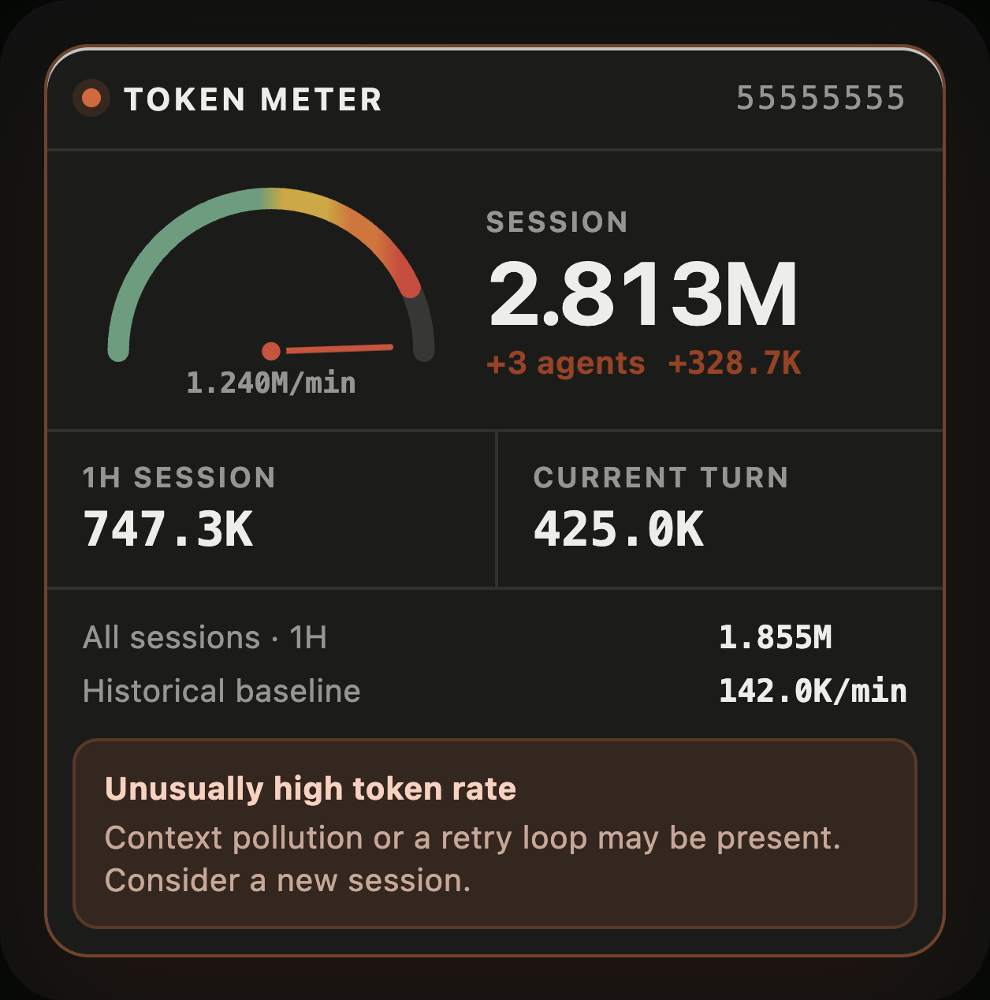
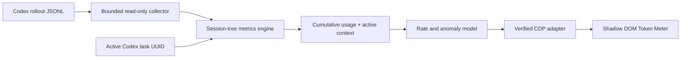

# Token Meter

<p align="center">
  
</p>

<p align="center">
  <a href="https://github.com/SergioChan/token-meter/actions/workflows/ci.yml"></a>
  <a href="LICENSE"></a>
  
  
</p>

**See how hard the agent is working. Catch runaway context before it consumes another turn.**

Token Meter is an open-source, local-first telemetry overlay for Codex Desktop. It follows the Session currently selected in the Codex UI and turns confirmed token events into a mechanical meter that moves while the agent works.

It is designed for the failure mode that percentages hide: a polluted context, retry loop, or background-agent spiral that makes one interaction cost several times more than normal.

> [!IMPORTANT]
> Token Meter currently supports **Codex Desktop on macOS**. The planned Claude target is the **Code tab inside Claude Desktop**, with the same injected lower-right overlay—not the Claude Code CLI status line. Claude Desktop support is not implemented yet. See [Claude Desktop status](#claude-desktop-status).

## What it measures

| Metric | Meaning |
| --- | --- |
| **Session** | Locally reported raw cumulative tokens for the selected root Session and every known child Agent sharing its `session_id`. |
| **1H Session** | Locally reported raw token deltas for that Session tree during the trailing hour. |
| **Current Turn** | Locally reported raw cumulative deltas since the latest root user message. |
| **Active Context** | Codex-reported tokens currently occupying the selected root thread's context, shown against the active model context window. This value falls after compaction. |
| **Rate** | Confirmed deltas in a trailing 60-second window, normalized to tokens per minute. |
| **Baseline** | The median rate of completed historical turns, with p95 and median absolute deviation retained for anomaly detection. |

The counter never invents per-token streaming between host updates. It moves when Codex writes a new cumulative `TokenCount` snapshot and shows a visible `+delta` pulse, even when a compact `M` or `B` total would otherwise round to the same text. `TokenCount` is useful local telemetry, but it is not a billing-grade event and can include restored or estimated state.

### How Token Meter calculates usage

Token Meter derives its readings from Codex's local rollout telemetry:

1. It incrementally reads `~/.codex/sessions/**/rollout-*.jsonl` using bounded chunks. The parser retains numerical usage events, timestamps, Session identity, and turn boundaries only; it does not retain prompt, reasoning, tool, or assistant content.
2. It reads the exact task UUID selected in the Codex sidebar, resolves that task's root rollout, and groups every root and child-Agent rollout with the same `session_id`. Switching tasks switches the entire group atomically.
3. `SESSION` is the sum of the latest cumulative `total_token_usage.total_tokens` value reported by every rollout in that Session tree. It does not sum every historical snapshot.
4. `1H SESSION`, `CURRENT TURN`, and the rate gauge use positive changes between consecutive cumulative snapshots inside their respective time windows. A normal increment is `current - previous`; if a counter resets, the new value becomes the increment:

```text
delta = current >= previous ? current - previous : current
```

5. Cached input is already a subset of input and is not added a second time. It remains included at its full raw token count whenever Codex reports it. A turn can contain many upstream model requests around tool calls, and each reported request contributes to the raw workload.
6. The alert model compares the trailing 60-second raw-token rate with the median, p95, and median absolute deviation of completed historical turns.

This method is deliberately optimized for observability rather than billing reconciliation. Repeated large cached prompts, tool loops, retries, and child-Agent activity all increase the Meter, because they are meaningful signals of how hard the Agent is working and whether a Session may be unhealthy.

### Raw workload versus active context

Token Meter keeps two independent readings:

- `SESSION`, `1H SESSION`, `CURRENT TURN`, and the rate gauge use positive deltas from Codex's cumulative `total_token_usage`. This is a raw workload counter: cached input remains part of total input and is counted once each time Codex reports it.
- `ACTIVE CONTEXT` uses the selected root thread's latest `last_token_usage.total_tokens` and `model_context_window`. When Codex emits `context_compacted`, this reading resets to the smaller compacted context and then grows again.

This distinction follows Codex's own usage and compaction surfaces: the official App Server exposes active-thread usage updates and a `contextCompaction` lifecycle, while Codex configuration defines both the automatic compaction threshold and model context window. See the [Codex App Server reference](https://developers.openai.com/codex/app-server/) and [configuration reference](https://developers.openai.com/codex/config-reference/).

### Why this does not match Codex `/usage`

Codex `/usage` is a separate backend account statistic. Its App Server method, `account/usage/read`, accepts no Session or thread parameter and returns only an account summary plus optional daily buckets. The public protocol exposes no per-Session backend attribution, and OpenAI does not publish the backend aggregation, normalization, or compression formula that maps rollout `total_token_usage` to the account activity number.

The [official Codex rate card](https://help.openai.com/en/articles/20001106-codex-rate-card) confirms that uncached input, cached input, and output have different credit rates. That does not establish that the `/usage` chart applies the same weighting, and Token Meter will not present a reverse-engineered estimate as an exact backend Session total.

The two values therefore are not expected to match exactly. The practical boundary is:

- Token Meter can measure Session-bound local raw workload and rate under one consistent collector method.
- Codex can return exact backend account-level daily activity through `/usage`.
- No currently exposed API can return exact backend-accounted usage for one Session.

Despite that difference, the local reading remains useful as a consistent relative instrument: its absolute value is not a `/usage` bill, but its movement, rate, historical deviation, and Session-to-Session comparison reveal Agent intensity and potential Session pollution.

See [the account-usage reconciliation note](docs/research/codex-account-usage-reconciliation.md) for the protocol evidence and known limitations.

## Live intensity and alerts

The needle moves from left to right as the current rate rises relative to the learned historical scale:

- Green: below 50% intensity.
- Yellow: 50–70%.
- Orange: 70–85%.
- Red: 85% and above.

Color is an immediate intensity cue. Alerts use a separate, conservative statistical threshold so a red needle does not automatically assert that Codex is broken.

| Normal monitoring | Unusually high rate |
| --- | --- |
|  |  |

_Screenshots are captured from the real injected Shadow DOM runtime with controlled sample telemetry and a privacy backdrop._

## Support status

| Host | Status | UI | Usage source |
| --- | --- | --- | --- |
| Codex Desktop, macOS | Supported | Injected lower-right overlay | Local rollout token events |
| Claude Code in Claude Desktop, macOS | Not implemented | Planned injected lower-right overlay | Planned Desktop Session binding and transcript usage collector |
| Codex Desktop, Windows/Linux | Not implemented | — | — |

Validated locally against Codex Desktop `26.730.61639 (6234)`. Codex DOM and rollout formats are compatibility surfaces, so newer builds must pass the release checks in [the architecture document](docs/architecture.md).

## Install from source

Requirements:

- macOS.
- Codex Desktop installed at `/Applications/ChatGPT.app`, or `CODEX_APP_PATH` set to the official application bundle.
- Node.js 22.12 or newer for development. The launcher uses the Node runtime bundled with Codex.

```bash
git clone https://github.com/SergioChan/token-meter.git
cd token-meter
npm test
npm run check
```

Install the persistent per-user service:

```bash
./scripts/install-token-meter-macos.sh
```

Installation copies the runtime to `~/Library/Application Support/Token Meter/` and loads `~/Library/LaunchAgents/com.sergiochan.token-meter.plist`. After that, open Codex normally from the Dock or Applications folder—no special command is required on each launch, and the service returns automatically after login or reboot.

If a new Codex process starts without the required loopback debugging endpoint, the service performs one normal quit and relaunch with the endpoint enabled. It never force-quits, and it will not retry the same process after a failed recovery attempt. Logs contain lifecycle messages only and live in `~/Library/Logs/Token Meter/`.

To update an existing installation after pulling a new version, run the installer again:

```bash
git pull --ff-only
./scripts/install-token-meter-macos.sh
```

For one-shot development without installing the LaunchAgent, use:

```bash
./scripts/start-codex-meter-macos.sh --restart
```

Keep that terminal open. The one-shot launcher remains intentionally separate from the normal persistent installation.

## Security boundary

Token Meter is an unofficial local desktop companion, not a documented Codex host-UI extension. It does not modify, unpack, replace, or re-sign the official application bundle.

Before injection, the launcher and injector:

1. Verify the exact application path and bundle identifier `com.openai.codex`.
2. Verify the official code signature and OpenAI Team ID.
3. Bind CDP to `127.0.0.1` only and reject an occupied port.
4. Verify the listening socket belongs to the expected Codex process tree.
5. Probe renderer semantics before registering any persistent script.
6. Reject Avatar, blank, and auxiliary renderer surfaces.
7. Limit automatic launch recovery to one normal quit/relaunch per Codex process.

CDP is a privileged local debugging interface. Do not run untrusted local software while it is enabled. See [SECURITY.md](SECURITY.md) for the threat model and vulnerability reporting process.

## Session binding

Token Meter reads the exact UUID from Codex's active semantic sidebar row. When you switch tasks, the entire Meter switches atomically to the new Session.

If the selected UUID cannot be validated or matched to local telemetry, the Meter displays `SESSION UNKNOWN`. It never guesses from the newest rollout file and never carries numbers over from a previous Session.

## Uninstall and restore Codex

Remove the LaunchAgent, installed runtime, overlay, and local lifecycle logs, then normally restart Codex without the debugging port:

```bash
./scripts/uninstall-token-meter-macos.sh --restart
```

Without `--restart`, the service and overlay are removed immediately; the current Codex process keeps its loopback debugging port until you quit it normally. For a one-shot development run, press Control-C or use `./scripts/stop-codex-meter-macos.sh --restart`.

## Read-only snapshots

Inspect one Session without injecting UI:

```bash
/Applications/ChatGPT.app/Contents/Resources/cua_node/bin/node \
  src/cli.mjs snapshot --thread-id <thread-uuid>
```

The parser retains numerical usage events and timing metadata only. It does not retain prompt, reasoning, tool, or assistant content.

## Architecture



The measurement core is host-independent. Codex-specific rollout and UI code lives behind adapters so a future Claude Desktop adapter can reuse the same Session, window, turn, rate, and alert semantics.

Read [docs/architecture.md](docs/architecture.md) for invariants and [the original feasibility study](docs/research/codex-token-meter-feasibility.md) for source-level research.

## Development

```bash
npm test
npm run check
```

With an injected Codex instance running on port 9334, regenerate the README screenshots:

```bash
npm run screenshots
```

## Claude Desktop status

**No: this repository does not support Claude Code inside Claude Desktop today.** There is no Claude Desktop injector, selected-Session probe, usage collector, installer, or Claude-specific test suite in the current tree.

The target is the graphical Code tab documented by Anthropic, not a terminal status line. The intended adapter is:

1. Inject the same Shadow DOM meter into the verified Claude Desktop main renderer.
2. Read the exact Session selected in the Desktop sidebar; never infer it from the newest process or transcript.
3. Map the Desktop Session identity to the underlying Claude Code transcript identity.
4. Aggregate confirmed usage events into Session, trailing-hour, current-turn, rate, and baseline snapshots.
5. Switch the complete meter atomically whenever the selected Desktop Session changes.

Local inspection confirms that this architecture is plausible, but the relevant files and renderer structure are undocumented, version-sensitive compatibility surfaces. The exact selected-Session renderer binding still requires an explicit restart-approved live CDP probe. Until that probe, fixtures, and live accuracy checks pass, the support status remains **Not implemented**.

See [the Claude Desktop adapter status](docs/claude-code.md). Anthropic's public product documentation confirms that [the Code tab is Claude Code's graphical Desktop interface](https://code.claude.com/docs/en/desktop).

## Contributing

Contributions are welcome. Start with [CONTRIBUTING.md](CONTRIBUTING.md), follow the privacy and fail-closed invariants, and include tests for behavior changes.

## License and attribution

Token Meter is released under the [MIT License](LICENSE).

The Codex injection architecture was informed by [Fei-Away/Codex-Dream-Skin](https://github.com/Fei-Away/Codex-Dream-Skin). Token Meter is not affiliated with or endorsed by OpenAI or Anthropic. Codex, Claude, and Claude Code are trademarks of their respective owners.
