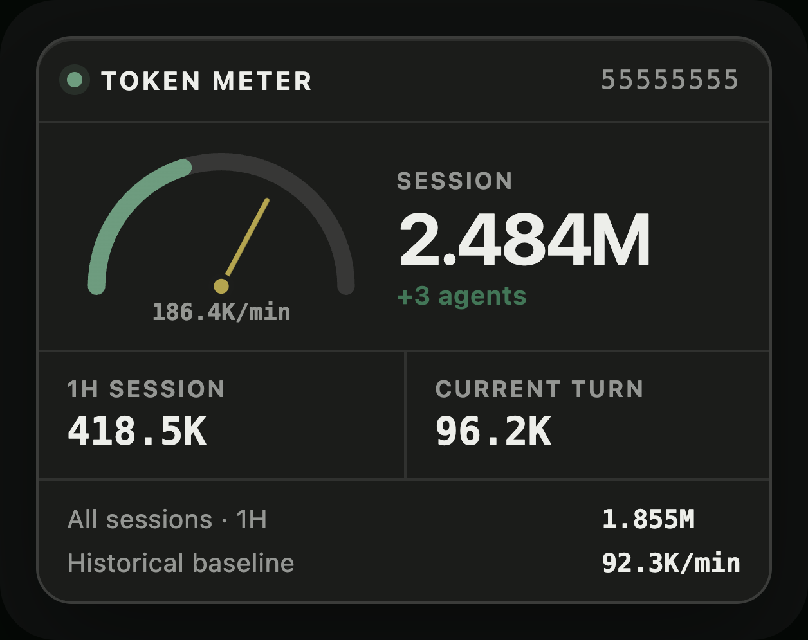
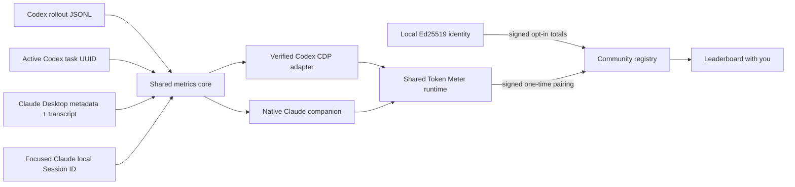

# Token Meter

<p align="center">
  
</p>

<p align="center">
  <a href="https://github.com/SergioChan/token-meter/actions/workflows/ci.yml"></a>
  <a href="LICENSE"></a>
  
  
</p>

**See how hard the Agent is working. Catch runaway context before it consumes another turn.**

Token Meter is an open-source, local-first telemetry overlay for Codex Desktop and Claude Code inside Claude Desktop. It follows the Session currently selected in the host UI and turns confirmed local token events into a mechanical meter that moves while the Agent works.

It is designed for the failure mode that percentages hide: a polluted context, retry loop, or background-Agent spiral that makes one interaction cost several times more than normal.

## Host integrations

| Host | Status | UI integration | Exact Session source | Usage source |
| --- | --- | --- | --- | --- |
| Codex Desktop, macOS | Supported | Verified loopback CDP + injected Shadow DOM | Active semantic sidebar task UUID | Local rollout token events |
| Claude Code in Claude Desktop, macOS | Beta | Independent native companion overlay | Focused Code window Accessibility URL | Local transcripts or cached cloud usage events |
| Windows and Linux | Not implemented | — | — | — |

Claude's production app blocks public CDP debugging without an Anthropic-signed authorization value. Token Meter does not bypass that control. The Claude integration is therefore a native overlay: it does not inject into, patch, re-sign, modify, quit, or relaunch Claude.app.

Read the integration modules for their exact invariants:

- [Codex Desktop integration](integrations/codex-desktop/README.md)
- [Claude Code in Claude Desktop integration](integrations/claude-desktop/README.md)

## What the Meter shows

| Metric | Meaning |
| --- | --- |
| **Session** | Locally reported raw cumulative tokens for the selected root Session and its known child Agents. |
| **1H Session** | Raw token deltas for that Session tree during the trailing hour. |
| **Current Turn** | Raw cumulative deltas since the latest root user message. |
| **Active Context** | Tokens currently occupying the selected root context, shown against its model context window when available. |
| **Rate** | Confirmed deltas in a trailing 60-second window, normalized to tokens per minute. |
| **Baseline** | Historical completed-turn median, p95, and median absolute deviation used for anomaly detection. |

The needle moves from green through yellow and orange to red as live rate rises relative to the learned scale. The alert threshold is separate and deliberately conservative: a red needle communicates intensity, not a claim that the host is broken.

## Collapse and drag

Both Desktop integrations provide the same layout controls:

- Click `−` to collapse the Meter to its gauge and live `tokens/min` value.
- Click `+` to expand it.
- Drag the header while expanded.
- Drag the gauge while collapsed.
- Position and collapsed state persist across Session changes and service restarts.

Codex stores layout state in its local renderer storage. Claude stores it under `~/Library/Application Support/Token Meter/State/Claude Desktop/`.

## How usage is calculated

Token Meter measures local raw model workload, not subscription billing.

### Codex

The collector incrementally reads `~/.codex/sessions/**/rollout-*.jsonl`, retains numerical events and timing metadata only, and groups the exact selected root task with descendants sharing its `session_id`.

`SESSION` is the sum of the latest cumulative `total_token_usage.total_tokens` values for that Session tree. Windowed metrics use positive changes between consecutive cumulative snapshots:

```text
delta = current >= previous ? current - previous : current
```

Cached input remains included once whenever Codex reports it. `ACTIVE CONTEXT` is separate: it uses the selected root thread's latest `last_token_usage.total_tokens` and `model_context_window`, so it can fall after compaction while cumulative Session workload never decreases.

This local workload does not strictly match Codex `/usage`. The backend account surface has no per-Session attribution and OpenAI does not publish the aggregation, normalization, or compression formula that maps local rollout telemetry to its account chart. See [the reconciliation note](docs/research/codex-account-usage-reconciliation.md).

### Claude

For legacy local Sessions, the collector resolves the exact Desktop
`local_<uuid>` to its underlying Claude Code transcript. For current cloud
Code Sessions, it binds the exact mixed-case `session_<24 chars>` route and
reads the locally cached, paginated `/events` responses only when their
sequence is complete. Both paths de-duplicate repeated response rows by
`message.id` and count one latest confirmed contribution per response:

```text
raw tokens = input_tokens
           + cache_creation_input_tokens
           + cache_read_input_tokens
           + output_tokens
```

Claude `ACTIVE CONTEXT` uses the latest root response's input side only:

```text
active context = input_tokens
               + cache_creation_input_tokens
               + cache_read_input_tokens
```

Output is intentionally excluded from context occupancy. The denominator comes from a strict Context-window button ratio inside the same exact Code web area when present, otherwise from the installed Claude model catalog matched to the exact Session model. Model-catalog caches are invalidated when the installed catalog changes. These local formats are private, version-sensitive compatibility surfaces.

Neither host collector retains prompt, reasoning, tool, or assistant content in the metrics index.

## Identity, sharing, and “you”

Token Widget creates one Ed25519 key pair on the Mac. The public-key hash becomes a stable Meter ID such as `TM-ABCD-EFGH-JKLM`; the private key remains in the local Application Support directory and is used only to sign registry requests. No account, email address, or password is required.

Choose **Check your ranking** in the widget, or **Open community leaderboard** in the local dashboard, to connect a browser:

1. The local app signs a short-lived browser-pairing request.
2. The registry returns a random, single-use code that expires after five minutes.
3. The code travels in the URL fragment, which is removed before the page makes a request.
4. After a successful exchange, the browser receives an HTTP-only, secure, 30-day session cookie.
5. The Leaderboard compares the authenticated Meter's opaque row ID with each public row and labels the match **you**.

Browser pairing and community sharing are separate choices. Pairing identifies the browser but does not upload usage. **Data stays local** is the default; a Meter appears in the ranking only after **Share with community** is enabled. The registry receives signed aggregate totals and platform counts, never transcript content or the private key. Disconnecting the browser revokes that browser session without changing the local Meter identity.

The Leaderboard ranks a rolling seven-day Token total. Its Session count uses the same window and counts each root Session with at least one Token event during those seven days. Lifetime Token and Session totals remain available in the private local dashboard and public profile; they are not used as the Leaderboard's weekly Session figure. Older clients can continue uploading, but the Leaderboard shows their seven-day Session count as pending until a compatible client reports it.

## Install with an Agent

Attach [INSTALL_WITH_AGENT.md](INSTALL_WITH_AGENT.md) to Codex, Claude Code, or another capable local coding Agent. The file is an executable installation prompt that covers host detection, tests, restart approval boundaries, Accessibility, installation, and real runtime verification.

## Install from source

Token Meter currently distributes the Claude integration as source only. Each developer builds the companion locally; the project does not publish a prebuilt, Developer ID-signed, or notarized Claude application package.

Requirements:

- macOS.
- Git.
- Node.js 22.12 or newer.
- Xcode Command Line Tools with Swift for building the Claude companion.
- Official Codex Desktop and/or Claude Desktop application bundles.

```bash
git clone https://github.com/SergioChan/token-meter.git
cd token-meter
npm run ci
```

### Codex Desktop

```bash
./scripts/install-token-meter-macos.sh
```

The installer loads `~/Library/LaunchAgents/com.sergiochan.token-meter.plist`. If a running Codex process lacks the required loopback endpoint, the service performs at most one normal quit/relaunch attempt. It never force-quits or loops relaunches.

The Codex runtime is isolated at `~/Library/Application Support/Token Meter/Codex Desktop/`; installing or uninstalling it does not replace the Claude companion or its saved state.

After installation, Codex can be opened normally from the Dock or Applications folder.

### Claude Code in Claude Desktop

Check local build prerequisites first:

```bash
./scripts/doctor-claude-meter-macos.sh
```

```bash
./scripts/install-claude-meter-macos.sh
```

The installer skips incompatible Node.js versions in common Homebrew, PATH, and nvm locations. If a specific compatible runtime must be selected:

```bash
./scripts/install-claude-meter-macos.sh --node /opt/homebrew/bin/node
```

The app is built locally and ad-hoc signed by default. macOS may therefore ask for Accessibility approval again after a rebuild. Enable **Token Widget for Claude** when prompted; Claude remains running throughout installation.

To build only the local `.app` bundle for inspection instead of installing it:

```bash
./integrations/claude-desktop/scripts/build-app.sh \
  --output "$PWD/local-artifacts/Token Widget for Claude.app"
```

The standalone build output still expects the repository runtime and a compatible local Node.js path; use the installer for the complete LaunchAgent configuration.

Verify:

```bash
./scripts/status-claude-meter-macos.sh --json
```

See [the complete Claude installation guide](docs/install-claude-desktop.md) for permission, troubleshooting, update, and uninstall instructions.

## Security and privacy

Token Meter is an unofficial local desktop enhancement. It is not affiliated with or endorsed by OpenAI or Anthropic.

The Codex integration:

1. Verifies the canonical app path, bundle identifier, OpenAI Team ID, and code signature.
2. Binds CDP to `127.0.0.1` only.
3. Verifies listener process ownership and renderer semantics before injection.
4. Rejects auxiliary, blank, and lookalike surfaces.
5. Never modifies or re-signs Codex.app.

The Claude integration:

1. Verifies the canonical Claude.app path, bundle identifier, Anthropic Team ID, and code signature during installation.
2. Requires Accessibility permission for the independently signed Token Meter companion itself.
3. Accepts exactly one eligible `AXWebArea` URL in the focused window and reads only button titles that can carry the strict Context-window ratio.
4. Hides when Claude is not frontmost or exact Session identity is unavailable.
5. Never enables CDP, injects into Claude, or modifies/restarts Claude.app.

See [SECURITY.md](SECURITY.md) for the threat model and vulnerability reporting process.

## Session binding

Token Meter never guesses the selected Session from process recency, transcript modification time, or the newest local file.

- Codex reads the exact active semantic sidebar UUID.
- Claude reads an exact `local_<uuid>` or `session_<24 chars>` from the
  focused Code window's Accessibility URL. Local Sessions require one matching
  metadata record; cloud Sessions require one complete cached event sequence.

If validation fails, the Meter becomes unbound or hides instead of carrying numbers from the previous Session.

## Architecture



The shared core owns Session, hour, turn, context, rate, baseline, and alert semantics. Each host integration owns only its identity, telemetry, lifecycle, and presentation adapter.

Read [the architecture document](docs/architecture.md), [Codex feasibility study](docs/research/codex-token-meter-feasibility.md), and [Claude selected-Session signal research](docs/research/claude-selected-session-signals.md).

## Development

```bash
npm run ci
```

Useful commands:

```bash
npm run snapshot -- --thread-id <codex-thread-uuid>
npm run claude:snapshot -- --desktop-session-id local_<claude-session-uuid>
npm run claude:status -- --json
```

With an injected Codex instance on port 9334, regenerate controlled README screenshots:

```bash
npm run screenshots
```

Screenshots use controlled telemetry and a privacy backdrop. Demo recordings and local artifacts are intentionally excluded from Git.

## Compatibility

Validated locally on 2026-08-05 against:

- Codex Desktop `26.730.61639 (6234)`.
- Claude Desktop `1.24012.9` with bundled Claude Code `2.1.219`.

DOM, Accessibility, metadata, transcript, and packaged model-catalog formats are compatibility surfaces, not public extension contracts. Unknown or changed builds must fail closed until verified.

## Contributing

Contributions are welcome. Start with [CONTRIBUTING.md](CONTRIBUTING.md), preserve the privacy and fail-closed invariants, and include behavior tests for changes.

## License and attribution

Token Meter is released under the [MIT License](LICENSE).

The Codex injection architecture was informed by [Fei-Away/Codex-Dream-Skin](https://github.com/Fei-Away/Codex-Dream-Skin). Codex, Claude, and Claude Code are trademarks of their respective owners.
