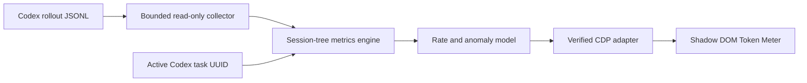

# Token Meter

<p align="center">
  
</p>

<p align="center">
  <a href="https://github.com/SergioChan/token-meter/actions/workflows/ci.yml"></a>
  <a href="LICENSE"></a>
  
  
</p>

**See how hard the agent is working. Catch runaway context before it consumes another turn.**

Token Meter is an open-source, local-first telemetry overlay for Codex Desktop. It follows the Session currently selected in the Codex UI and turns confirmed token events into a mechanical meter that moves while the agent works.

It is designed for the failure mode that percentages hide: a polluted context, retry loop, or background-agent spiral that makes one interaction cost several times more than normal.

> [!IMPORTANT]
> Token Meter currently supports **Codex Desktop on macOS**. The planned Claude target is the **Code tab inside Claude Desktop**, with the same injected lower-right overlay—not the Claude Code CLI status line. Claude Desktop support is not implemented yet. See [Claude Desktop status](#claude-desktop-status).

## What it measures

| Metric | Meaning |
| --- | --- |
| **Session** | Confirmed cumulative tokens for the selected root Session and every known child Agent sharing its `session_id`. |
| **1H Session** | Confirmed token deltas for that Session tree during the trailing hour. |
| **Current Turn** | Confirmed cumulative deltas since the latest root user message. |
| **Rate** | Confirmed deltas in a trailing 60-second window, normalized to tokens per minute. |
| **Baseline** | The median rate of completed historical turns, with p95 and median absolute deviation retained for anomaly detection. |

The counter never invents streamed usage. Codex records token usage after an upstream completion, so the Meter moves in truthful steps. Every positive confirmation also produces a visible `+delta` pulse, even when a compact `M` or `B` total would otherwise round to the same text.

## Live intensity and alerts

The needle moves from left to right as the current rate rises relative to the learned historical scale:

- Green: below 50% intensity.
- Yellow: 50–70%.
- Orange: 70–85%.
- Red: 85% and above.

Color is an immediate intensity cue. Alerts use a separate, conservative statistical threshold so a red needle does not automatically assert that Codex is broken.

| Normal monitoring | Unusually high rate |
| --- | --- |
|  |  |

_Screenshots are captured from the real injected Shadow DOM runtime with controlled sample telemetry and a privacy backdrop._

## Support status

| Host | Status | UI | Usage source |
| --- | --- | --- | --- |
| Codex Desktop, macOS | Supported | Injected lower-right overlay | Local rollout token events |
| Claude Code in Claude Desktop, macOS | Not implemented | Planned injected lower-right overlay | Planned Desktop Session binding and transcript usage collector |
| Codex Desktop, Windows/Linux | Not implemented | — | — |

Validated locally against Codex Desktop `26.730.61639 (6234)`. Codex DOM and rollout formats are compatibility surfaces, so newer builds must pass the release checks in [the architecture document](docs/architecture.md).

## Install from source

Requirements:

- macOS.
- Codex Desktop installed at `/Applications/ChatGPT.app`, or `CODEX_APP_PATH` set to the official application bundle.
- Node.js 22.12 or newer for development. The launcher uses the Node runtime bundled with Codex.

```bash
git clone https://github.com/SergioChan/token-meter.git
cd token-meter
npm test
npm run check
```

Start Token Meter:

```bash
./scripts/start-codex-meter-macos.sh --restart
```

The first start may request a normal Codex restart because Chromium DevTools Protocol must be enabled at launch. The script never force-quits Codex.

## Security boundary

Token Meter is an unofficial local desktop companion, not a documented Codex host-UI extension. It does not modify, unpack, replace, or re-sign the official application bundle.

Before injection, the launcher and injector:

1. Verify the exact application path and bundle identifier `com.openai.codex`.
2. Verify the official code signature and OpenAI Team ID.
3. Bind CDP to `127.0.0.1` only and reject an occupied port.
4. Verify the listening socket belongs to the expected Codex process tree.
5. Probe renderer semantics before registering any persistent script.
6. Reject Avatar, blank, and auxiliary renderer surfaces.

CDP is a privileged local debugging interface. Do not run untrusted local software while it is enabled. See [SECURITY.md](SECURITY.md) for the threat model and vulnerability reporting process.

## Session binding

Token Meter reads the exact UUID from Codex's active semantic sidebar row. When you switch tasks, the entire Meter switches atomically to the new Session.

If the selected UUID cannot be validated or matched to local telemetry, the Meter displays `SESSION UNKNOWN`. It never guesses from the newest rollout file and never carries numbers over from a previous Session.

## Stop and restore Codex

Press Control-C in the launcher terminal to remove the overlay. To remove the Meter and restart Codex without the debugging port:

```bash
./scripts/stop-codex-meter-macos.sh --restart
```

## Read-only snapshots

Inspect one Session without injecting UI:

```bash
/Applications/ChatGPT.app/Contents/Resources/cua_node/bin/node \
  src/cli.mjs snapshot --thread-id <thread-uuid>
```

The parser retains numerical usage events and timing metadata only. It does not retain prompt, reasoning, tool, or assistant content.

## Architecture



The measurement core is host-independent. Codex-specific rollout and UI code lives behind adapters so a future Claude Desktop adapter can reuse the same Session, window, turn, rate, and alert semantics.

Read [docs/architecture.md](docs/architecture.md) for invariants and [the original feasibility study](docs/research/codex-token-meter-feasibility.md) for source-level research.

## Development

```bash
npm test
npm run check
```

Preview the real renderer payload:

```bash
python3 -m http.server 4173 --bind 127.0.0.1
```

Open <http://127.0.0.1:4173/demo/preview.html>.

With an injected Codex instance running on port 9334, regenerate the README screenshots:

```bash
npm run screenshots
```

## Claude Desktop status

**No: this repository does not support Claude Code inside Claude Desktop today.** There is no Claude Desktop injector, selected-Session probe, usage collector, installer, or Claude-specific test suite in the current tree.

The target is the graphical Code tab documented by Anthropic, not a terminal status line. The intended adapter is:

1. Inject the same Shadow DOM meter into the verified Claude Desktop main renderer.
2. Read the exact Session selected in the Desktop sidebar; never infer it from the newest process or transcript.
3. Map the Desktop Session identity to the underlying Claude Code transcript identity.
4. Aggregate confirmed usage events into Session, trailing-hour, current-turn, rate, and baseline snapshots.
5. Switch the complete meter atomically whenever the selected Desktop Session changes.

Local inspection confirms that this architecture is plausible, but the relevant files and renderer structure are undocumented, version-sensitive compatibility surfaces. The exact selected-Session renderer binding still requires an explicit restart-approved live CDP probe. Until that probe, fixtures, and live accuracy checks pass, the support status remains **Not implemented**.

See [the Claude Desktop adapter status](docs/claude-code.md). Anthropic's public product documentation confirms that [the Code tab is Claude Code's graphical Desktop interface](https://code.claude.com/docs/en/desktop).

## Contributing

Contributions are welcome. Start with [CONTRIBUTING.md](CONTRIBUTING.md), follow the privacy and fail-closed invariants, and include tests for behavior changes.

## License and attribution

Token Meter is released under the [MIT License](LICENSE).

The Codex injection architecture was informed by [Fei-Away/Codex-Dream-Skin](https://github.com/Fei-Away/Codex-Dream-Skin). Token Meter is not affiliated with or endorsed by OpenAI or Anthropic. Codex, Claude, and Claude Code are trademarks of their respective owners.
