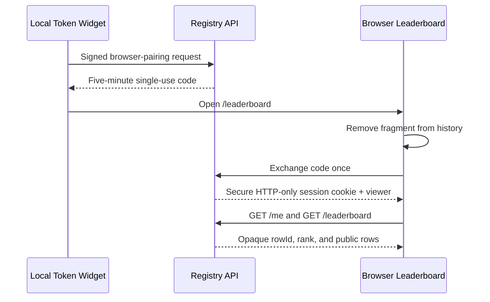

# Token Meter Architecture

## Decision

Token Meter is a local desktop enhancement with a small core and host adapters. The core knows nothing about Codex DOM selectors or Claude UI. Each host adapter must provide two things:

1. Exact active-session identity.
2. Confirmed token-usage events and turn boundaries.

The Codex implementation uses rollout JSONL as a read-only compatibility adapter and loopback CDP as an unofficial UI adapter. The Claude implementation uses local Claude Code transcripts for measurement and a separate native macOS companion for presentation.

Current host support:

- Codex Desktop on macOS: supported through verified renderer injection.
- Claude Code in Claude Desktop on macOS: Beta through a native companion overlay.
- Codex Desktop on Windows and Linux: implementation absent.

## Modules

```text
RolloutStore
  incremental bounded reads
  content-discarding event parser
        |
        v
MetricsEngine
  session-tree aggregation
  root-thread active context
  rolling windows
  current-turn delta
  historical baseline and anomaly level
        |
        v
CodexDesktopAdapter
  exact active-thread probe
  verified loopback CDP
  main-renderer validation
  shadow-DOM UI updates
```

The seam between the core and a host adapter is the snapshot shape returned by `MetricsEngine`. Both adapters produce the same Session, rolling-hour, current-turn, active-context, rate, baseline, and alert fields. Presentation receives numerical snapshots and never needs transcript content.

```text
ClaudeDesktopSessionStore
  exact Desktop sessionId -> cliSessionId mapping
        |
        v
ClaudeTranscriptStore
  bounded incremental reads
  response-ID de-duplication
  root + child-Agent aggregation
        |
        v
MetricsEngine
  shared Session, window, turn, rate, and alert snapshot
        |
        v
PersistentSnapshotBridge
  newline-delimited numerical snapshots
        |
        v
ClaudeNativeCompanion
  exact focused-window Accessibility URL
  non-activating panel
  window following, drag, and collapse
```

## Invariants

- A requested but unknown thread produces `status: "unbound"`; it never falls back to another thread.
- Session totals include every loaded rollout with the same root `session_id`.
- Codex uses its reported cumulative total directly, where cached input is already a subset of input. Claude transcript usage adds uncached input, cache creation, cache reads, and output because Anthropic reports those as separate fields.
- Claude active Context is a separate non-cumulative reading from the selected root response: uncached input plus cache creation plus cache reads. Output is excluded. A root compaction invalidates it until the next response. The transcript does not carry the context-window size, so only a verified window adapter may supply that denominator.
- Cumulative Session usage never decreases on compaction; active Context comes from the latest root-thread `last_token_usage` and may decrease.
- A `context_compacted` event is retained only as a timestamp; no compacted summary or conversation content is retained.
- Current-turn usage is a cumulative delta since the latest root user message, not `last_token_usage`.
- All rolling-window calculations sum positive cumulative deltas and tolerate counter resets.
- Prompt, reasoning, tool, and assistant content are never retained by the parser.
- Numerical UI values move only toward locally reported snapshots; no per-token stream is fabricated between host updates.
- Codex CDP connections are loopback-only and main-renderer-only.
- The official host bundle path, bundle ID, code signature, and signing Team ID are verified before the relevant adapter starts.
- A Codex renderer must pass the semantic probe before any persistent injection script is registered.
- The Claude companion accepts exactly one eligible `AXWebArea` in the focused Claude window and hides when an exact local Code Session cannot be proven.
- Neither adapter modifies, patches, replaces, or re-signs its official host application.

## Session switching

The Codex adapter polls the verified semantic active-thread attribute once per second. When the UUID changes, it requests a snapshot for the new root thread and atomically updates the entire meter. A missing or invalid UUID produces an unbound card. Child rollouts are indexed by root Session identity even when they were created in a later date directory. A recursive filesystem watcher invalidates the rollout index when a new child appears; the ten-second discovery interval remains a fallback rather than the normal update path.

The Claude companion reads the exact `local_<uuid>` from one eligible `AXWebArea` in the focused Code window. Exact means an HTTPS `claude.ai` URL whose complete path is `/epitaxy/local_<uuid>` or `/code/local_<uuid>`; links, extra path components, and multiple candidates are rejected. It resolves that value to one Desktop metadata record and one Claude Code transcript identity. A change replaces the full snapshot atomically. Missing, remote-only, invalid, or ambiguous identity hides the overlay rather than retaining the previous Session's values.

## Session versus thread

Codex descendants have their own thread IDs but share the root session ID. The default compact meter shows the session tree because background agents are part of the user's consumption and are central to the stated failure mode. The UI shows `+N agents` to make that aggregation explicit.

## Raw workload versus active context

The cumulative Session meter and the active Context meter answer different questions. Session usage sums positive cumulative-token deltas across the root and child Agents. It is a raw workload counter: every reported request counts its full input total, including the cached-input subset exactly once. It represents confirmed model processing and does not decrease when Codex compacts history.

Active Context is scoped to the selected root thread because every child Agent has its own independent context window. It uses the latest Codex-reported `last_token_usage.total_tokens` and `model_context_window`. A compaction event can therefore reduce active Context while cumulative Session usage remains unchanged. The snapshot also exposes root-thread compaction count and latest compaction time.

Neither metric claims to reproduce the backend account activity shown by Codex `/usage`.

## Account-usage boundary

The App Server's `account/usage/read` method has no parameters and returns an account summary plus optional daily buckets. It exposes no thread, Session, turn, model, input, cached-input, or output attribution. Conversely, `thread/tokenUsage/updated` and rollout `token_count` events expose raw thread usage but not the backend account weighting used by `/usage`.

Token Meter therefore does not infer an exact per-Session backend number. Account deltas cannot be assigned safely when Sessions, child Agents, other devices, or delayed backend aggregation overlap. The meter retains raw workload because repeated cached requests are still useful evidence of agent intensity and runaway loops, while documentation and UI must not call that reading an account bill or `/usage` equivalent.

## Community identity and passwordless browser pairing

Community identity starts locally. The client generates an Ed25519 key pair, derives the stable Meter ID from the SHA-256 hash of the public-key DER, and keeps the private key in the local identity directory. Registry writes are canonicalized and signed; the server independently derives the Meter ID before accepting them. A claimable handle is an optional public alias, not an authentication credential.

Sharing and browser authentication are deliberately separate state machines:



The registry stores only SHA-256 hashes of the random pairing and session secrets. The browser cookie uses the `__Host-` prefix, has no `Domain` attribute, and expires after 30 days. Public ranking rows use a stable truncated hash of the Meter ID rather than the full ID. An authenticated `/me` response returns the same opaque row ID, allowing the web client to label exactly one row **you** without putting the local private key or full Meter ID in public data.

Pairing succeeds even in local-only mode and returns `rank: null` until the Meter has reported usage. Enabling **Share with community** causes an immediate signed aggregate upload and future periodic uploads. Disabling it stops future uploads; it does not retroactively delete already shared public totals. Pairing never flips the sharing flag.

The aggregate history scan covers Codex, Claude Code, and Cline roots on the same machine. JSONL sources are read synchronously in bounded chunks rather than as whole strings; individual content rows above the safety limit are discarded until the next newline, while small numerical usage rows continue to be counted. Large or long-running scans checkpoint their file summaries atomically, so an interruption does not discard completed work.

The Claude snapshot hot path reads only the last completed aggregate cache. Signed community scans run in one background Worker and never block Session snapshots. This keeps a multi-gigabyte runaway rollout from freezing the live overlay while preserving one combined cross-platform report.

## Codex macOS lifecycle controller

The source installer copies the minimal runtime into the isolated `Token Meter/Codex Desktop` Application Support directory and loads a per-user LaunchAgent. The controller waits for Codex instead of opening it at login. A normal Dock launch without loopback CDP receives at most one normal quit/relaunch attempt for that process. Failed verification, an occupied port, a failed normal quit, or a failed relaunch all fail closed without a force-quit or relaunch loop.

The controller remains alive across later Codex launches and sleep/wake. `RunAtLoad` restores it after login; launchd does not use `KeepAlive`, so an unexpected controller crash cannot become a launchd crash loop. Re-running the installer refreshes the copied runtime and restarts the controller without modifying the official application bundle.

## Claude macOS companion lifecycle

The Claude installer builds and signs an independent `Token Widget for Claude.app`, copies the minimum runtime into the user's Application Support directory, and loads a per-user LaunchAgent. Source builds use ad-hoc signing unless a stable identity is supplied. The executable owns a non-activating `NSPanel`; it never executes code inside Claude's renderer.

macOS Accessibility permission is granted to the companion, not to the repository shell and not to Claude.app. The process writes atomic `health.json` state from startup onward. Status validates its PID against the exact executable, checks Accessibility live, and reports UI readiness, bridge health, and exact Session binding independently. A permission-blocked companion remains alive and reports a waiting process without falsely reporting trust. It detects both grant and revocation quietly; it neither repeats the system prompt nor quits or relaunches Claude.

During an update, the installer retains the previous app and LaunchAgent until the replacement process produces matching live health state. Bootstrap, process, or trusted-UI failure restores the previous installation.

One persistent Node bridge holds the transcript stores and metrics engine in memory. The Swift host sends the exact selected Desktop Session ID and receives a newline-delimited numerical snapshot. Timeout, malformed output, or bridge termination causes a restart or hidden meter; no stale snapshot is assigned to a new Session.

The same bridge owns community actions. **Check your ranking** asks it to sign a one-time pairing request, optionally refreshes already-consented aggregate usage, and returns a fixed `https://www.tokenwidget.app/leaderboard#pair=...` URL. The Swift host rejects any other scheme, host, path, query, or fragment shape before asking macOS to open it.

The identity probe inspects at most 512 Accessibility roles in a shallow focused-window search and never descends into the selected web area's conversation tree. Context enrichment is separate and runs at most once every five seconds: it reads titles from buttons inside that same web area until an exact Context-window ratio is found. It does not read static text, values, descriptions, or message bodies. The model-catalog fallback is keyed by the exact model returned with the Session snapshot and invalidates cached windows when the installed catalog fingerprint changes.

## Alert model

Historical completed-turn rates are summarized by median, mean, p95, and median absolute deviation. The initial classifier is deliberately conservative and has a learning state until at least five completed historical turns, 20 seconds of current activity, and 10,000 current-turn tokens are present.

Alerts are advisory. Token Meter never interrupts Codex, kills an agent, or creates a new session automatically.

## Compatibility policy

Every Desktop integration relies on version-sensitive compatibility surfaces. Supporting a Codex release requires:

- An exact active-thread UUID probe.
- Main-renderer marker verification.
- Auxiliary-renderer rejection.
- Runtime syntax and idempotency checks.
- A live navigation and cleanup smoke test.
- A persistent-controller login load, normal-launch recovery, and one-attempt failure check.

Supporting a Claude release requires:

- Exact local Code Session identity from the focused Accessibility window.
- One unambiguous Desktop Session-to-transcript mapping.
- Transcript response de-duplication and content-discarding parser checks.
- Verified official application identity and installed model catalog.
- Native overlay focus, display-coordinate, Session-switch, drag, and collapse checks.
- LaunchAgent readiness and Accessibility denial checks that do not restart Claude.

Unknown builds and formats fail closed until verified.

The latest live validation recorded in this repository used Codex Desktop `26.730.61639 (6234)` and Claude Desktop `1.24012.9` with bundled Claude Code `2.1.219` on macOS.

## Claude Desktop adapter boundary

The Claude target is the Code surface inside Claude Desktop, not the Claude Code CLI status line. It reuses the metrics and visual-language layers, but not the Codex Session probe, rollout reader, CDP verifier, renderer allowlist, or injected DOM.

Claude Desktop `1.24012.9` rejects public CDP debugging unless a short-lived `CLAUDE_CDP_AUTH` value validates against Anthropic's embedded public key and exact user-data directory. Token Meter does not forge or bypass that control. Its supported path is therefore the independent native companion described above.

The Claude adapter has four host-specific responsibilities:

1. Verify the official Claude application identity and packaged model catalog before installation.
2. Read an exact local Session ID from the focused Code window and map it to the underlying Claude Code transcript identity.
3. Convert confirmed, de-duplicated transcript usage events into the shared snapshot model without retaining message content.
4. Present that snapshot in a non-activating panel positioned relative to the focused Claude window, with persistent drag and collapse state.

Observed Accessibility URLs, Desktop metadata, transcript formats, and packaged model catalogs are undocumented compatibility surfaces. Missing or ambiguous identity, remote-only telemetry, an unknown format, or an unsupported build must hide or unbind the meter rather than guess a Session. See [claude-code.md](claude-code.md).
