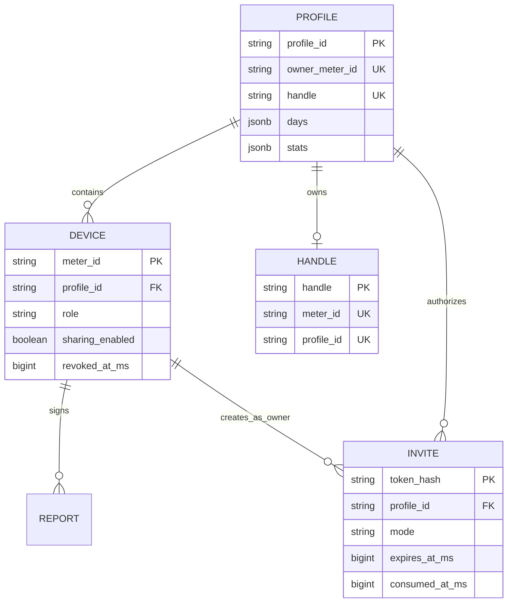

# Sharing, consent, and community Profiles

This document is the product and protocol specification for data that moves between a Token Widget installation and the optional community registry.

## Principles

1. **Local by default.** A fresh install uploads nothing. The dashboard and live widget work from local telemetry.
2. **Per-device consent.** Pairing a browser, reserving a handle, or joining a Profile does not enable sharing. Every computer must explicitly opt in.
3. **Aggregates only.** The registry receives bounded numerical aggregates and active dates, never prompts, transcripts, code, file names, hostnames, Session/message IDs, or private keys.
4. **Reversible per device.** Switching to **Data stays local** removes that computer's uploaded contribution and stops future uploads. Other active Profile devices are unchanged.
5. **One Profile, independent keys.** Every computer keeps its own Ed25519 key and Meter ID. Devices join a Profile through a short-lived invitation; private keys are never copied between computers.
6. **A handle is globally unique.** `registry_handles.handle` remains the uniqueness authority. A join operation links membership and never runs the handle-claim path.
7. **Signed authorization.** Claims, reports, withdrawals, invitations, joins, membership checks, revocations, and ownership transfers are signed. The server derives the Meter ID from the public key before accepting the payload.

## Data model

The legacy Meter row remains the signed aggregate snapshot for one device. A Profile rollup is derived from every active, non-revoked, sharing-enabled Device snapshot. Before a second device joins, the Profile output must equal the original Meter output.

## First run and handle reservation

The widget shows a one-time **Pick your @handle** banner. Reserving a handle locally does not claim it globally and does not enable sharing. The identity records that the prompt was shown so it does not repeatedly interrupt the user.

The share wizard performs the public transition:

1. Enter or confirm a handle. Availability is checked against the registry, and taken handles receive verified-available suggestions.
2. Read the exact disclosure and select the agreement checkbox.
3. Press **Publish to leaderboard**.
4. The local server claims the globally unique handle, enables sharing, and sends the first signed aggregate report.
5. A lost handle race returns to the handle step. A registry outage leaves the previous local state intact.

Browser pairing and public sharing are separate. A local-only identity may pair a browser and receive `rank: null` without uploading usage.

## Add or replace another computer

Only the active owner Device can create an invitation.

### Add

Use **Add** when two independent computers should both contribute:

1. The owner requests a random 32-byte base64url token.
2. The server stores only `SHA-256(token)`, with the owner Meter ID, Profile ID, mode, creation time, and ten-minute expiry.
3. The new computer creates or keeps its own local identity and submits the token in a signed join request.
4. The transaction locks and consumes the invite exactly once, verifies the inviting Device is still the owner, creates the member relationship, and returns the existing Profile handle.
5. The joining computer stores `profileId`, role, handle, label, and confirmation time locally. Sharing remains off unless the user explicitly enables it.

Concurrent use of the same token yields one successful join. Replays and expired tokens return `410`. A Device already linked to another Profile cannot join.

### Replace

Use **Replace** when moving from an old member computer to a new one. The owner names the old member Meter ID when creating the invite. The successful join transaction revokes the old membership, disables its contribution, records the replacement, and recomputes the Profile before the new Device can report.

The owner cannot be a replacement target. Transfer ownership first if the owner computer itself is being retired.

### Overlapping histories

The server cannot safely de-duplicate identical private Sessions across computers because Session IDs and hostnames are intentionally absent from reports. If two computers hold copies of overlapping cloud/synced history, **Add** can double-count that overlap. Prefer **Replace**, or share from only one overlapping Device.

## Device management

The owner may:

- list current and revoked devices;
- create Add or Replace invitations;
- revoke an active member;
- transfer ownership to an active member.

The owner cannot revoke itself. Ownership transfer atomically changes the owner role and canonical handle signer while keeping the Profile ID, handle, public URL, and aggregate history stable.

A revoked Device can no longer report, create browser pairings, issue invitations, or query active membership. The periodic local sync notices `member: false`, removes cached Profile membership, and disables sharing on that computer.

## Stop sharing from one computer

The **Data stays local** action sends the existing signed v1 withdrawal for the current Meter, then disables sharing locally.

Server behavior:

- blank that Meter's `days`, `stats`, `week_tokens`, and `generated_at_ms`;
- mark that Device membership as not sharing;
- recompute the Profile from remaining active sharing Devices;
- retain the Meter identity, Profile membership, and handle claim.

If no Device remains sharing, the Profile has `generated_at_ms = NULL` and disappears from the leaderboard. `GET /api/v1/profile/<handle>` returns `{handle, shared: false}` so the Profile URL can explain that data is local rather than pretending the handle is unknown.

If the registry is unreachable, local sharing still switches off and `pendingWithdraw` is recorded. The background worker retries the signed withdrawal until the server confirms it.

This is a per-device withdrawal, not a destructive whole-Profile delete. A future full-account deletion flow, if added, must use a separate owner-authorized endpoint and disclosure.

## Signed wire protocol

All signed requests include `meterId`, `publicKey`, `generatedAtMs`, and a canonicalized Ed25519 signature. Requests outside the 15-minute freshness window are rejected unless an endpoint specifies a narrower expiry.

### Legacy-compatible v1

- `POST /api/v1/claim` — atomically claims a globally unique handle for a Meter/Profile owner.
- `POST /api/v1/report` — uploads one Device's bounded daily totals and aggregate statistics.
- `POST /api/v1/withdraw` — removes the current Device contribution while preserving identity and handle.
- `POST /api/v1/browser-pairings` — creates a five-minute, one-use passwordless browser pairing.

Old clients continue to report through v1. New clients try v2 reporting first and fall back to v1 only when the server returns `404` or `405`.

### v2 usage report

`POST /api/v2/report` uses `kind: "usage-v2"` and `reportVersion: 2`. It carries the same public aggregates as v1 plus internal merge primitives:

- `tokenBreakdown`: input, output, cache-read, and cache-write token totals;
- `hours[24]`: token totals by local hour;
- `weekdayTokens[7]`: token totals by weekday;
- `sessionTokenHistogram[8]`: counts in fixed token-size buckets;
- `activeDates`: bounded dates with positive usage.

Server validation requires all merge sums to agree with the public aggregate:

- token breakdown total equals lifetime tokens;
- hour bins equal lifetime tokens;
- weekday bins equal lifetime tokens;
- platform tokens equal lifetime tokens;
- histogram count equals Session count.

Malformed or inconsistent reports return `422`. Non-negative safe-integer and payload-size bounds prevent overflow and resource exhaustion.

For a multi-device Profile, daily/platform/lifetime totals, hour and weekday bins, active dates, streaks, and token shares can be merged exactly. The median Session size is reconstructed from the fixed histogram and is explicitly approximate. Legacy-only fields that cannot be merged exactly are marked partial in the internal aggregation metadata.

The internal `stats.merge` object is removed from public Profile and leaderboard responses.

### v2 membership and management

- `POST /api/v2/profile-invites`
- `POST /api/v2/profile-join`
- `POST /api/v2/profile-membership`
- `POST /api/v2/profile-devices`
- `POST /api/v2/profile-devices/revoke`
- `POST /api/v2/profile-devices/transfer-owner`

Owner-only endpoints verify active membership and owner role from the database, not from a client-provided role. Join verifies the invite hash and current owner authority inside the same transaction that consumes the token.

## Public Profile and leaderboard

The Profile page mirrors the local dashboard where data is available: lifetime and weekly totals, activity calendar, platform split, coding patterns, daily rhythm, top days, and live rank. Sections degrade gracefully for older v1 reports.

The leaderboard ranks rolling-seven-day Profile token totals. Its seven-day Session count is separate from lifetime Session count. Browser authentication compares opaque row IDs; public responses never expose full Meter IDs or private membership lists.

## Migration and compatibility

The server uses a staged read switch:

1. deploy compatible code with Profile reads off;
2. apply additive migration/backfill;
3. restart into Meter + Profile shadow dual-write;
4. reconcile late v1 writes and verify every rollup;
5. enable `TOKEN_WIDGET_PROFILE_READS=1`;
6. release multi-device clients only after observation.

Disabling Profile reads is the preferred rollback. Additive tables remain intact; no destructive down-migration is used. See [the production migration runbook](multi-device-migration.md).

## Test map

Behavior coverage includes:

- explicit consent and atomic first publish;
- lost handle race and available suggestions;
- v1 and v2 signed report validation;
- v2-to-v1 client fallback;
- privacy rejection for Session/message/hostname fields;
- one-device Profile parity and multi-device rollups;
- invitation expiry, replay, concurrent use, and owner authorization;
- join without handle reclaim;
- Add, Replace, revoke, and ownership transfer;
- revoked-device report and browser-pairing rejection;
- per-device withdrawal and retry;
- migration idempotence, immutable checksums, late-v1 reconciliation, and rollup verification;
- File store and PostgreSQL (`pg-mem`) parity.
